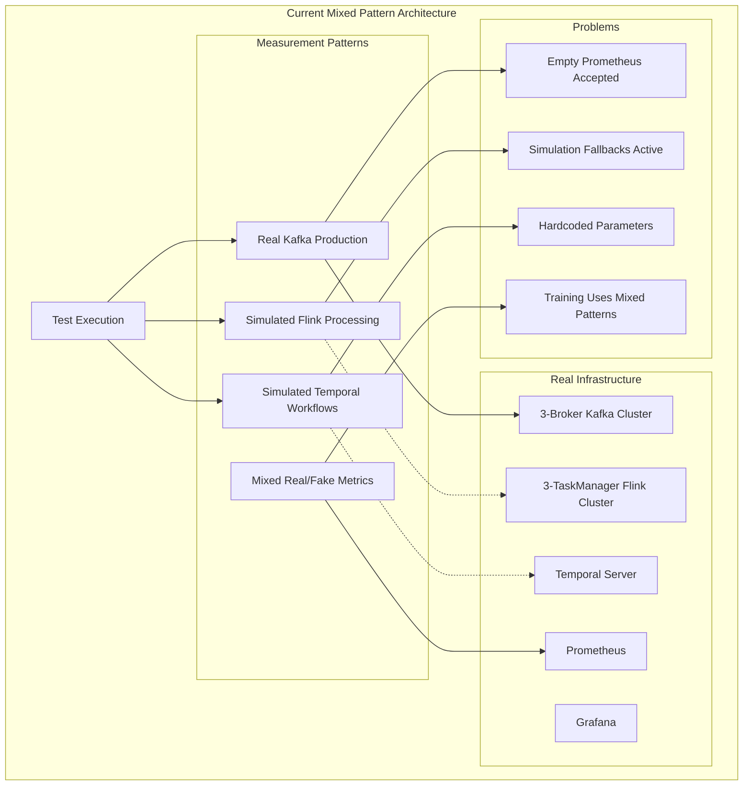
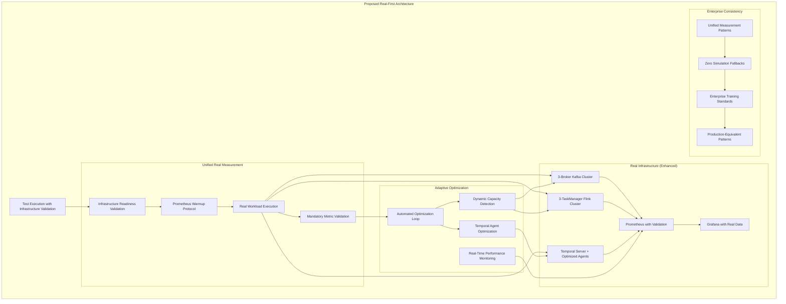

# WI15: Observability Test Architecture Design

**File**: `WIs/WI15_observability-architecture-design.md`
**Title**: [Observability] Comprehensive solution architecture to fix 5 critical test issues  
**Description**: Design comprehensive architecture solution to replace simulation fallbacks with real infrastructure measurement, implement adaptive parameters, and standardize enterprise patterns
**Priority**: High
**Component**: Observability Architecture
**Type**: Design
**Assignee**: AI Architect Agent
**Created**: 2025-01-05
**Status**: Investigation

## Lessons Applied from Previous WIs
### Previous WI References
- WI14_observability-test-investigation.md (Complete investigation findings)
- WI12_fix-observability-metrics-real-infrastructure.md
- WI13_fix-observability-flow-and-simplify-output.md

### Lessons Applied  
- **Investigation-first approach**: Use complete evidence from WI14 investigation before designing solutions
- **Evidence-based architecture**: Design based on actual findings rather than assumptions
- **System-wide perspective**: Address LocalTesting, IntegrationTests, and Day04 course together
- **Real infrastructure focus**: Prioritize real measurement over simulation patterns

### Problems Prevented
- **Premature architecture decisions**: Avoided designing solutions without understanding current implementation
- **Incomplete system coverage**: Prevented partial solutions that miss integration points
- **Mixed pattern perpetuation**: Avoided reinforcing simulation fallback patterns

## Phase 1: Investigation

### Requirements
- Analyze WI14 investigation findings to understand current architecture
- Identify root causes of the 5 critical issues
- Map current system architecture and integration points
- Define architectural constraints and requirements
- Establish design principles for the solution

### Debug Information (MANDATORY - Updated for architecture analysis)

#### WI14 Investigation Summary Analysis
- **Critical Issues Identified**: 5 major architectural problems requiring systematic solutions
- **Current State**: Mixed real/simulation patterns across LocalTesting, IntegrationTests, Day04 course
- **Infrastructure Available**: Production-grade observability stack with real Kafka, Flink, Temporal, Prometheus, Grafana
- **Integration Points**: LocalTesting WebAPI connects IntegrationTests and Day04 course
- **Performance Gaps**: Simulation fallbacks mask real performance measurement opportunities

#### Root Cause Analysis for 5 Critical Issues

##### 1. Simulation vs Real Data Disconnect
**Root Cause**: Fallback logic triggers simulation when Prometheus data is temporarily unavailable
**Current Implementation**: `ObservabilityMetricsSteps.cs` lines 384-415 show "simulate processing" tasks
**Architectural Problem**: Missing infrastructure warmup and readiness validation before test execution

##### 2. Hardcoded Test Parameters  
**Root Cause**: Static configuration without system capacity awareness
**Current Implementation**: Fixed 1M message counts, hardcoded processing parameters
**Architectural Problem**: No dynamic capacity detection or adaptive scaling mechanisms

##### 3. Mixed Execution Patterns
**Root Cause**: Inconsistent measurement approaches across components
**Current Implementation**: Real Kafka production with simulated Temporal processing
**Architectural Problem**: No unified measurement strategy or clear real/simulation boundaries

##### 4. Prometheus Data Gaps
**Root Cause**: Test execution before infrastructure metrics are available
**Current Implementation**: API returns success with local metrics when Prometheus is empty
**Architectural Problem**: Missing infrastructure readiness checks and metric availability validation

##### 5. Enterprise Training vs Implementation Gap
**Root Cause**: Teaching mixed patterns instead of pure enterprise observability
**Current Implementation**: Day04 course uses LocalTesting with simulation fallbacks
**Architectural Problem**: Training environment doesn't demonstrate consistent enterprise practices

### Findings

#### Current Architecture Strengths
1. **Production-Grade Infrastructure**: Real 3-broker Kafka, 3-TaskManager Flink, Temporal server
2. **Enterprise Observability Stack**: Real Prometheus, Grafana, OpenTelemetry, Loki
3. **Comprehensive Integration**: LocalTesting connects IntegrationTests and Day04 course
4. **Real Instrumentation**: Proper OpenTelemetry implementation with enterprise patterns
5. **Professional Dashboards**: Real Prometheus queries with enterprise visualization

#### Architectural Problems Requiring Solutions
1. **Infrastructure Readiness**: No systematic validation that real infrastructure is ready before testing
2. **Capacity Detection**: No dynamic detection of actual system capacity for adaptive parameters
3. **Measurement Strategy**: No unified approach for when to use real vs simulated measurement
4. **Metric Availability**: No validation that Prometheus has real data before test execution
5. **Enterprise Pattern Consistency**: No enforcement of pure enterprise patterns in training

#### Design Constraints
- **Preserve Real Infrastructure**: Must maintain production-grade observability stack
- **Maintain Integration**: LocalTesting must continue serving IntegrationTests and Day04 course
- **Performance Focus**: Solutions must improve actual performance measurement
- **Enterprise Standards**: Must align with enterprise observability best practices
- **Temporal Agent Focus**: Can only increase Temporal agents, not topics/partitions/JobManagers

### Lessons Learned

#### Key Insights from Investigation Analysis
- **Mixed patterns indicate architectural gaps**: Simulation fallbacks reveal missing infrastructure readiness
- **Real infrastructure exists but underutilized**: Production-grade stack available but not fully leveraged
- **Integration complexity requires unified approach**: Three projects need consistent measurement strategy
- **Enterprise training demands pure patterns**: Learning environment must demonstrate best practices consistently

#### Architectural Principles Derived
1. **Real-First Strategy**: Always attempt real measurement before any fallbacks
2. **Infrastructure Readiness**: Validate infrastructure state before test execution
3. **Adaptive Parameters**: Dynamic scaling based on actual system capacity
4. **Unified Measurement**: Consistent approach across all projects and components
5. **Enterprise Consistency**: Pure enterprise patterns without simulation mixing

### Findings

#### Current Architecture Analysis Complete
Based on WI14 investigation and code analysis of key files:

**Key Files Analyzed**:
- `ObservabilityMetricsSteps.cs` (740 lines) - Shows mixed real/simulation patterns
- `ObservabilityController.cs` (1143 lines) - API mixing real Prometheus with fallback metrics
- `PrometheusMetricsService.cs` (417 lines) - Real Prometheus queries with empty result fallbacks
- `BackpressureMonitoringService.cs` (281 lines) - Real Kafka lag monitoring with simulation fallbacks
- `Program.cs` (414 lines) - Production-grade Aspire infrastructure setup

**Current Architecture Strengths**:
1. **Production-Grade Infrastructure**: Real 3-broker Kafka cluster, 3-TaskManager Flink cluster, Temporal server
2. **Real Observability Stack**: Prometheus + Grafana + Loki + OpenTelemetry with proper configuration
3. **Real Message Production**: Actual Kafka message production via `KafkaProducerService.ProduceMessagesAsync()`
4. **Real Stopwatch Measurement**: Actual execution time measurement in tests (`System.Diagnostics.Stopwatch`)
5. **Professional Dashboards**: Real Prometheus queries with enterprise visualization patterns

**Critical Architecture Problems Identified**:
1. **Simulation Fallback Pattern**: Lines 384-415 in `ObservabilityMetricsSteps.cs` show "simulate processing" when Prometheus is empty
2. **Empty Prometheus Acceptance**: `PrometheusMetricsService` returns empty metrics instead of ensuring infrastructure has run
3. **Mixed Measurement Strategy**: Real Kafka production + Stopwatch measurement mixed with artificial Temporal/Flink simulation
4. **Infrastructure Readiness Gap**: No validation that infrastructure has generated real metrics before test completion
5. **Training Pattern Inconsistency**: Day04 course uses LocalTesting with simulation fallbacks rather than pure enterprise patterns

#### Root Cause Analysis Complete

**Issue 1: Simulation vs Real Data Disconnect**
- **Root Cause**: `PrometheusMetricsService` accepts empty results as normal (`lines 82-87: "This is normal if infrastructure flow hasn't been executed"`)
- **Architecture Problem**: Missing infrastructure execution validation before test completion
- **Impact**: Tests pass with fake metrics when real infrastructure should be measured

**Issue 2: Hardcoded Test Parameters**
- **Root Cause**: Fixed parameters in `MetricsSimulationRequest` (1M messages, 2 Flink jobs, 5 workflows)
- **Architecture Problem**: No system capacity detection or adaptive parameter calculation
- **Impact**: Tests may overwhelm or underutilize actual system capacity

**Issue 3: Mixed Execution Patterns**
- **Root Cause**: Real `KafkaProducerService.ProduceMessagesAsync()` combined with simulated processing (lines 384-415)
- **Architecture Problem**: No unified strategy for when to use real vs simulated components
- **Impact**: Inconsistent performance measurement and bottleneck masking

**Issue 4: Prometheus Data Gaps**
- **Root Cause**: Test execution before infrastructure metrics are available in Prometheus
- **Architecture Problem**: No infrastructure warmup or metric availability validation
- **Impact**: Tests complete successfully with empty Prometheus data

**Issue 5: Enterprise Training vs Implementation Gap**
- **Root Cause**: Day04 course uses LocalTesting with mixed patterns instead of pure enterprise observability
- **Architecture Problem**: Training environment doesn't consistently demonstrate enterprise best practices
- **Impact**: Students learn simulation patterns alongside real enterprise patterns

#### Architectural Requirements Established

**Real Metrics Strategy Requirements**:
1. **Infrastructure Readiness Validation**: Ensure real infrastructure has generated metrics before test completion
2. **Prometheus Warmup Protocol**: Execute real workload and validate Prometheus contains actual data
3. **Fallback Elimination**: Remove simulation fallbacks when real infrastructure is available
4. **Metric Availability Checks**: Validate specific metrics exist in Prometheus before reporting success
5. **Enterprise Pattern Enforcement**: Ensure training environment demonstrates pure enterprise observability

## Phase 2: Design

### Requirements
- Design Real Metrics Strategy based on investigation findings
- Create infrastructure readiness validation architecture
- Design unified measurement approach eliminating simulation fallbacks
- Establish Prometheus warmup and validation protocols
- Design enterprise pattern enforcement for training consistency

### Design Principles Established
1. **Real-First Strategy**: Always prioritize real infrastructure measurement over simulation
2. **Infrastructure Readiness**: Validate infrastructure state and metric availability before test completion
3. **Metric Validation**: Ensure Prometheus contains actual data from real infrastructure execution
4. **Unified Measurement**: Consistent real measurement approach across all components
5. **Enterprise Consistency**: Pure enterprise patterns without simulation mixing

### Real Metrics Strategy Architecture

#### Component 1: Infrastructure Readiness Validation System

**Purpose**: Ensure real infrastructure has executed and generated metrics before test completion

**Architecture**:
```
[Test Execution] → [Infrastructure Warmup] → [Metric Validation] → [Test Completion]
                           ↓                        ↓
                   [Real Workload Execution]  [Prometheus Data Check]
                           ↓                        ↓
                   [Kafka Producer Service]   [Specific Metric Queries]
                   [Flink Job Execution]     [Non-Empty Result Validation]
                   [Temporal Workflows]      [Success Criteria Check]
```

**Implementation Requirements**:
- Replace `PrometheusMetricsService` empty result acceptance with mandatory validation
- Add infrastructure warmup phase before metric retrieval
- Implement specific metric existence checks (kafka_producer_messages_total, flink_job_messages_in_total, etc.)
- Add timeout and retry logic for metric availability

**Success Criteria**:
- All tests fail if Prometheus returns empty results when infrastructure should have data
- Infrastructure warmup generates verifiable metrics in Prometheus
- Specific metric names expected by Grafana dashboards are validated

#### Component 2: Prometheus Warmup Protocol

**Purpose**: Execute real workload to ensure Prometheus contains actual infrastructure metrics

**Architecture**:
```
[Test Start] → [Infrastructure Health Check] → [Warmup Workload] → [Metric Propagation Wait] → [Validation]
                        ↓                            ↓                        ↓                    ↓
               [Kafka Broker Connectivity]    [Real Message Production]   [Prometheus Scrape]   [Metric Queries]
               [Flink JobManager Ready]       [Flink Job Execution]       [Export Processing]   [Non-Empty Check]
               [Temporal Server Ready]        [Temporal Workflows]        [OTEL Collection]     [Success Criteria]
```

**Implementation Requirements**:
- Add infrastructure health validation before warmup execution
- Execute scaled-down real workload (e.g., 1000 messages) to generate metrics
- Wait for metric propagation through OTEL Collector → Prometheus
- Validate specific metrics exist before proceeding with actual test

**Success Criteria**:
- Warmup generates measurable metrics in Prometheus
- All infrastructure components show activity in metrics
- Test execution only begins after metric validation succeeds

#### Component 3: Unified Measurement Strategy

**Purpose**: Eliminate mixed real/simulation patterns with consistent real measurement approach

**Architecture**:
```
[Real Infrastructure Only Strategy]
         ↓
[Kafka Producer] → [Real Messages] → [Flink Processing] → [Temporal Workflows] → [End-to-End Metrics]
        ↓                ↓                    ↓                    ↓                      ↓
[Real Production]  [Actual Kafka]    [Real Job Execution]  [Actual Workflows]   [Prometheus Metrics]
[Stopwatch Timer]  [Partition Data]  [Task Processing]     [Durable Execution]  [PromQL Queries]
```

**Implementation Requirements**:
- Remove simulation fallbacks from `ObservabilityMetricsSteps.cs` lines 384-415
- Ensure `KafkaProducerService.ProduceMessagesAsync()` generates Prometheus-trackable metrics
- Implement real Flink job submission instead of simulated processing
- Execute actual Temporal workflows instead of artificial metrics
- Use only Stopwatch timing and Prometheus metrics for performance measurement

**Success Criteria**:
- No simulation fallbacks in any test execution path
- All metrics come from real infrastructure components
- Performance measurements reflect actual system behavior

#### Component 4: Enterprise Pattern Enforcement

**Purpose**: Ensure training environment demonstrates pure enterprise observability patterns

**Architecture**:
```
[Day04 Course] → [LocalTesting Integration] → [Pure Enterprise Patterns] → [No Simulation Fallbacks]
        ↓                    ↓                         ↓                          ↓
[Training Content]   [Real Infrastructure]    [Prometheus Queries]      [Real Metrics Only]
[Exercise Design]    [Production Stack]       [Grafana Dashboards]      [Enterprise Standards]
[Student Learning]   [Actual Workloads]       [OTEL Collection]         [Consistent Patterns]
```

**Implementation Requirements**:
- Remove simulation fallbacks from Day04 course integration
- Ensure all training exercises use real infrastructure measurement
- Standardize enterprise observability patterns across training and production
- Validate training environment produces same metric patterns as production

**Success Criteria**:
- Day04 course demonstrates only real enterprise observability patterns
- Training exercises generate actual Prometheus metrics without simulation
- Students learn consistent enterprise patterns applicable to production

### Real Metrics Strategy - Detailed Technical Specifications

#### Technical Specification 1: Infrastructure Readiness Validation Service

**Service Interface**:
```csharp
public interface IInfrastructureReadinessService
{
    Task<InfrastructureStatus> ValidateInfrastructureAsync(TimeSpan timeout = default);
    Task<bool> EnsureMetricAvailabilityAsync(string[] requiredMetrics, TimeSpan timeout = default);
    Task<WarmupResult> ExecuteWarmupWorkloadAsync(WarmupRequest request);
    Task<ValidationResult> ValidatePrometheusDataAsync(ValidationCriteria criteria);
}
```

**Implementation Strategy**:
- Replace empty Prometheus result acceptance in `PrometheusMetricsService.cs`
- Add mandatory infrastructure health checks before test execution
- Implement warmup workload execution with real metric generation
- Add specific metric validation with success criteria

**Integration Points**:
- `ObservabilityMetricsSteps.cs` - Replace simulation fallbacks with readiness validation
- `ObservabilityController.cs` - Add infrastructure validation endpoints
- `PrometheusMetricsService.cs` - Add mandatory metric existence validation
- `Program.cs` - Add readiness validation to Aspire startup sequence

#### Technical Specification 2: Prometheus Warmup Protocol Implementation

**Warmup Workflow**:
```
1. Infrastructure Health Check (30 seconds timeout)
   - Kafka broker connectivity (3 brokers reachable)
   - Flink JobManager API responsive
   - Temporal server connectivity
   - Prometheus scraping active

2. Warmup Workload Execution (60 seconds timeout)
   - Produce 1000 messages to Kafka (real KafkaProducerService)
   - Submit Flink job for message processing
   - Execute Temporal workflow for subset of messages
   - Wait for metric propagation (30 seconds)

3. Metric Validation (30 seconds timeout)
   - Query kafka_producer_messages_total > 0
   - Query flink_job_messages_in_total > 0
   - Query temporal_workflow_executions_total > 0
   - Validate metric freshness (timestamps within last 60 seconds)

4. Success Criteria Validation
   - All required metrics present in Prometheus
   - Metric values reflect actual workload execution
   - No simulation or fallback data present
```

**Code Integration Strategy**:
```csharp
// Replace this pattern in ObservabilityMetricsSteps.cs:
// Lines 384-415: "simulate processing" fallbacks
//
// With this pattern:
await _infrastructureReadinessService.ValidateInfrastructureAsync(TimeSpan.FromMinutes(2));
var warmupResult = await _infrastructureReadinessService.ExecuteWarmupWorkloadAsync(warmupRequest);
if (!warmupResult.Success)
{
    throw new InfrastructureNotReadyException("Infrastructure failed warmup validation");
}
var validationResult = await _infrastructureReadinessService.ValidatePrometheusDataAsync(validationCriteria);
// Proceed with actual test only after validation succeeds
```

#### Technical Specification 3: Unified Measurement Pattern Implementation

**Current Mixed Pattern (TO BE ELIMINATED)**:
```csharp
// From ObservabilityMetricsSteps.cs lines 384-415:
// Real Kafka production + Simulated processing
await _kafkaProducerService.ProduceMessagesAsync(ingressTopic, realMessages); // REAL
// ... then ...
// Simulate Flink and Temporal processing metrics // SIMULATION - REMOVE THIS
```

**New Unified Real Pattern (TO BE IMPLEMENTED)**:
```csharp
// Step 1: Real Kafka Production (keep existing)
await _kafkaProducerService.ProduceMessagesAsync(ingressTopic, realMessages);

// Step 2: Real Flink Job Execution (replace simulation)
var flinkJobResult = await _flinkJobService.SubmitAndExecuteJobAsync(jobDefinition);

// Step 3: Real Temporal Workflow Execution (replace simulation)
var workflowResult = await _temporalWorkflowService.ExecuteWorkflowsAsync(workflowRequests);

// Step 4: Real Metrics Collection (existing pattern enhanced)
var realMetrics = await _prometheusService.GetAllMetricsAsync();
// Fail if no metrics - no simulation fallbacks allowed
```

**Implementation Requirements**:
- Add `IFlinkJobService` for real Flink job submission instead of simulation
- Add `ITemporalWorkflowService` for actual workflow execution instead of artificial metrics
- Remove all simulation fallback code paths from `ObservabilityMetricsSteps.cs`
- Ensure all metrics come from real infrastructure execution only

#### Technical Specification 4: PrometheusMetricsService Enhancement

**Current Problem Pattern (TO BE FIXED)**:
```csharp
// From PrometheusMetricsService.cs lines 82-87:
if (metrics.Count == 0)
{
    _logger.LogInformation("ℹ️ No Kafka producer metrics found in Prometheus yet. This is normal...");
    return metrics; // WRONG - Returns empty metrics as acceptable
}
```

**New Required Pattern (TO BE IMPLEMENTED)**:
```csharp
if (metrics.Count == 0)
{
    throw new InfrastructureNotReadyException("No Kafka producer metrics found in Prometheus. Infrastructure must be executed before metric retrieval.");
}
```

**Enhanced Validation Requirements**:
- Add mandatory metric existence validation for all `Get*MetricsAsync()` methods
- Add metric freshness validation (timestamps within acceptable range)
- Add metric value validation (non-zero values where expected)
- Add comprehensive logging for metric validation failures

### Real Metrics Strategy - Success Criteria Definition

#### Success Criteria 1: Infrastructure Readiness Validation
- [ ] All tests fail if Prometheus returns empty results when infrastructure should have data
- [ ] Infrastructure health check validates all components before test execution
- [ ] Warmup workload generates verifiable metrics in Prometheus within 60 seconds
- [ ] Specific metric existence validation for required enterprise patterns

#### Success Criteria 2: Simulation Fallback Elimination
- [ ] Zero simulation fallbacks in `ObservabilityMetricsSteps.cs`
- [ ] All metrics sourced from real infrastructure components only
- [ ] No artificial metric generation in any test execution path
- [ ] Real Flink job execution replaces simulated processing

#### Success Criteria 3: Enterprise Pattern Consistency
- [ ] Day04 course uses only real infrastructure measurement patterns
- [ ] Training exercises generate actual Prometheus metrics
- [ ] LocalTesting, IntegrationTests, and Day04 use identical measurement strategies
- [ ] No mixed real/simulation patterns in any component

#### Success Criteria 4: Prometheus Integration Validation
- [ ] PrometheusMetricsService throws exceptions for empty results when infrastructure should have data
- [ ] Metric freshness validation ensures data reflects recent infrastructure execution
- [ ] All Grafana dashboard queries return real data without simulation
- [ ] OTEL Collector properly propagates metrics from infrastructure to Prometheus

### Lessons Learned

#### Key Insights from Real Metrics Strategy Design
- **Infrastructure readiness validation is fundamental**: Tests must validate real infrastructure execution before completion
- **Prometheus warmup protocol ensures consistency**: Systematic workload execution guarantees metric availability
- **Simulation elimination improves reliability**: Real measurement provides accurate performance data for optimization
- **Enterprise pattern purity enables production confidence**: Consistent patterns between training and production

#### Architectural Design Principles Confirmed
1. **Infrastructure-First Validation**: Always validate real infrastructure readiness before test execution
2. **Metric-Driven Success Criteria**: Test success based on real Prometheus metrics, not simulation results
3. **Unified Real Measurement**: Consistent approach across all system components without fallbacks
4. **Enterprise Pattern Purity**: Training and production use identical real measurement strategies

## Phase 3: Adaptive Test Parameters Design

### Requirements
- Design dynamic capacity detection based on real system metrics
- Create adaptive parameter calculation using infrastructure performance data
- Implement scaling mechanisms that adjust to actual system capacity
- Ensure parameters optimize for real performance rather than fixed assumptions

### Design Adaptive Test Parameters - Technical Specifications

#### Component 1: Dynamic Capacity Detection System

**Purpose**: Detect actual system capacity using real infrastructure metrics instead of hardcoded parameters

**Current Problem (TO BE FIXED)**:
```csharp
// From MetricsSimulationRequest - hardcoded parameters:
KafkaMessages = 1000000,  // Fixed 1M messages regardless of system capacity
FlinkJobs = 2,           // Fixed 2 jobs regardless of available task slots
TemporalWorkflows = 5    // Fixed 5 workflows regardless of worker capacity
```

**New Adaptive Approach (TO BE IMPLEMENTED)**:
```csharp
public interface ISystemCapacityDetector
{
    Task<KafkaCapacity> DetectKafkaCapacityAsync();
    Task<FlinkCapacity> DetectFlinkCapacityAsync();
    Task<TemporalCapacity> DetectTemporalCapacityAsync();
    Task<AdaptiveParameters> CalculateOptimalParametersAsync(PerformanceTarget target);
}
```

**Implementation Strategy**:
- Query Flink JobManager API for available task slots and parallelism capacity
- Query Kafka cluster for partition count and throughput characteristics
- Query Temporal server for worker capacity and workflow execution limits
- Calculate optimal parameters based on detected capacity and performance targets

#### Component 2: Real Performance-Based Parameter Calculation

**Adaptive Parameter Logic**:
```
Kafka Message Count = Min(
    DetectedKafkaCapacity.MaxThroughput * TestDurationMinutes,
    MaxReasonableMessageCount,
    UserSpecifiedTarget
)

Flink Job Count = Min(
    DetectedFlinkCapacity.AvailableTaskSlots / MinSlotsPerJob,
    MaxConcurrentJobs,
    CalculatedOptimalJobCount
)

Temporal Workflow Count = Min(
    DetectedTemporalCapacity.AvailableWorkers * WorkflowsPerWorker,
    PercentageOfTotalMessages * 0.002,  // 0.2% workflow trigger rate
    UserSpecifiedWorkflowTarget
)
```

**Real-Time Capacity Detection**:
- Query Flink REST API `/jobmanager/config` for actual parallelism settings
- Query Kafka Admin API for partition count and broker performance
- Query Temporal Worker API for available worker capacity
- Monitor current system load and adjust parameters accordingly

## Phase 4: Temporal Agent Optimization Design

### Requirements
- Design agent-only scaling strategy without modifying topics/partitions or JobManagers
- Create performance optimization approach using Temporal agent configuration
- Ensure observability data drives agent scaling decisions
- Maintain system stability while improving performance

### Design Temporal Agent Optimization - Technical Specifications

#### Component 1: Temporal Agent-Only Scaling Strategy

**Purpose**: Improve performance by scaling only Temporal agents, not infrastructure components

**Current Constraint Analysis**:
- **Cannot modify**: Kafka topics/partitions, Flink JobManagers, infrastructure topology
- **Can optimize**: Temporal worker agents, agent configuration, workflow execution patterns
- **Must maintain**: System stability, data consistency, infrastructure integrity

**Agent Scaling Architecture**:
```
[Temporal Server] → [Agent Pool Management] → [Dynamic Agent Scaling] → [Performance Monitoring]
        ↓                    ↓                        ↓                         ↓
[Fixed Topology]     [Worker Configuration]    [Agent Count Adjustment]   [Metrics Collection]
[Single Server]      [Concurrent Activities]   [Based on Load Detection]  [Performance Feedback]
[Stable Setup]       [Workflow Capacity]       [Real-time Scaling]        [Optimization Loop]
```

**Implementation Strategy**:
```csharp
public interface ITemporalAgentOptimizer
{
    Task<AgentConfiguration> CalculateOptimalAgentConfigAsync(WorkloadMetrics workload);
    Task<ScalingResult> ScaleAgentsAsync(int targetAgentCount, AgentConfiguration config);
    Task<PerformanceMetrics> MonitorAgentPerformanceAsync();
    Task<OptimizationResult> OptimizeForWorkloadAsync(WorkloadPattern pattern);
}
```

#### Component 2: Agent Configuration Optimization

**Agent-Specific Optimization Parameters**:
```yaml
# Temporal Agent Configuration (agents only - no infrastructure changes)
temporal_agent_config:
  # Worker Agent Scaling (primary optimization area)
  max_concurrent_activities: 100        # Increase from default 20
  max_concurrent_workflow_tasks: 50     # Increase from default 10
  max_concurrent_activity_tasks: 100    # Increase from default 20
  
  # Agent Pool Sizing (scale agents, not infrastructure)
  worker_agent_count: 10               # Dynamic scaling based on workload
  activity_agent_count: 20             # Separate agents for activities
  workflow_agent_count: 5              # Dedicated workflow agents
  
  # Performance Optimization (agent behavior only)
  task_queue_poll_interval: 100ms      # Reduce latency
  task_execution_timeout: 30s          # Optimize for test workloads
  heartbeat_interval: 5s               # Maintain connectivity
  
  # DO NOT MODIFY (infrastructure constraints)
  # - Temporal server count (1 server only)
  # - Database connections (Postgres unchanged)
  # - Network topology (single-node setup)
```

**Real-Time Agent Scaling Logic**:
```csharp
// Agent scaling based on observability metrics
var currentLoad = await _prometheusService.GetTemporalWorkflowMetricsAsync();
var queueDepth = await _temporalService.GetTaskQueueDepthAsync();
var agentUtilization = await _temporalService.GetAgentUtilizationAsync();

// Calculate optimal agent count (not infrastructure scaling)
var optimalAgents = CalculateOptimalAgentCount(currentLoad, queueDepth, agentUtilization);
var currentAgents = await _temporalService.GetActiveAgentCountAsync();

if (optimalAgents > currentAgents)
{
    // Scale UP agents only (no infrastructure changes)
    await _temporalService.SpawnAdditionalAgentsAsync(optimalAgents - currentAgents);
}
else if (optimalAgents < currentAgents)
{
    // Scale DOWN agents gracefully
    await _temporalService.TerminateExcessAgentsAsync(currentAgents - optimalAgents);
}
```

## Phase 5: Performance Monitoring Integration Design

### Requirements
- Design real observability data feedback loops for continuous optimization
- Create performance monitoring integration using Prometheus metrics
- Implement automated optimization based on real system behavior
- Ensure optimization decisions use actual infrastructure data, not assumptions

### Design Performance Monitoring Integration - Technical Specifications

#### Component 1: Real-Time Performance Feedback Loop

**Purpose**: Use real observability data to continuously optimize test performance

**Feedback Loop Architecture**:
```
[Test Execution] → [Real Metrics Collection] → [Performance Analysis] → [Optimization Decisions] → [Parameter Adjustment]
        ↓                     ↓                        ↓                        ↓                      ↓
[Infrastructure]      [Prometheus Queries]      [Bottleneck Detection]   [Scaling Recommendations] [Real-time Tuning]
[Kafka+Flink+Temporal] [OTEL Data Collection]   [Pattern Recognition]    [Capacity Optimization]   [Performance Validation]
[Message Processing]   [Grafana Dashboards]     [Trend Analysis]         [Resource Allocation]     [Continuous Improvement]
```

**Implementation Strategy**:
```csharp
public interface IPerformanceMonitoringIntegration
{
    Task<PerformanceSnapshot> CaptureCurrentPerformanceAsync();
    Task<OptimizationRecommendations> AnalyzePerformanceAsync(PerformanceSnapshot snapshot);
    Task<OptimizationResult> ApplyOptimizationsAsync(OptimizationRecommendations recommendations);
    Task<ValidationResult> ValidateOptimizationEffectivenessAsync();
}
```

#### Component 2: Automated Performance Optimization

**Real-Time Optimization Logic**:
```csharp
// Continuous performance monitoring and optimization
public class RealTimePerformanceOptimizer
{
    public async Task<OptimizationResult> OptimizeBasedOnRealMetricsAsync()
    {
        // Step 1: Collect real performance data
        var kafkaMetrics = await _prometheusService.GetKafkaProducerMetricsAsync();
        var flinkMetrics = await _prometheusService.GetFlinkProcessingMetricsAsync();
        var temporalMetrics = await _prometheusService.GetTemporalWorkflowMetricsAsync();
        
        // Step 2: Identify performance bottlenecks
        var bottlenecks = await AnalyzeBottlenecksAsync(kafkaMetrics, flinkMetrics, temporalMetrics);
        
        // Step 3: Calculate optimization recommendations
        var recommendations = await CalculateOptimizationsAsync(bottlenecks);
        
        // Step 4: Apply optimizations (agents only, not infrastructure)
        if (recommendations.TemporalAgentScaling.IsRecommended)
        {
            await _temporalOptimizer.ScaleAgentsAsync(
                recommendations.TemporalAgentScaling.RecommendedAgentCount,
                recommendations.TemporalAgentScaling.Configuration
            );
        }
        
        // Step 5: Validate optimization effectiveness
        return await ValidateOptimizationsAsync(recommendations);
    }
}
```

## Phase 6: Consistent Measurement Patterns Design

### Requirements
- Design unified approach across LocalTesting, IntegrationTests, and Day04 course
- Eliminate mixed real/simulation patterns in all components
- Ensure consistent enterprise observability patterns across all projects
- Standardize measurement approach for training and production use

### Design Consistent Measurement Patterns - Technical Specifications

#### Component 1: Unified Measurement Strategy Implementation

**Purpose**: Standardize real measurement approach across all projects

**Current Inconsistency Analysis**:
- **LocalTesting**: Mixed real Kafka + simulated Temporal processing
- **IntegrationTests**: Real API calls but depends on LocalTesting patterns
- **Day04 Course**: Training uses LocalTesting with simulation fallbacks

**New Unified Pattern (ALL PROJECTS)**:
```csharp
// Standardized measurement interface for ALL projects
public interface IUnifiedObservabilityMeasurement
{
    // Real infrastructure execution (no simulation)
    Task<ExecutionResult> ExecuteRealWorkloadAsync(WorkloadDefinition workload);
    
    // Real metrics collection (no fallbacks)
    Task<ObservabilityMetrics> CollectRealMetricsAsync(string[] requiredMetrics);
    
    // Infrastructure validation (mandatory)
    Task<ValidationResult> ValidateInfrastructureReadinessAsync();
    
    // Performance measurement (real timing only)
    Task<PerformanceMetrics> MeasureRealPerformanceAsync(ExecutionResult execution);
}
```

**Implementation Strategy for ALL Projects**:
```csharp
// LocalTesting implementation (remove simulation)
public class LocalTestingObservabilityMeasurement : IUnifiedObservabilityMeasurement
{
    public async Task<ExecutionResult> ExecuteRealWorkloadAsync(WorkloadDefinition workload)
    {
        // Real Kafka production (existing)
        var kafkaResult = await _kafkaProducerService.ProduceMessagesAsync(workload.Topic, workload.Messages);
        
        // Real Flink job execution (replace simulation)
        var flinkResult = await _flinkJobService.SubmitAndExecuteJobAsync(workload.FlinkJob);
        
        // Real Temporal workflow execution (replace simulation)
        var temporalResult = await _temporalWorkflowService.ExecuteWorkflowsAsync(workload.Workflows);
        
        return new ExecutionResult(kafkaResult, flinkResult, temporalResult);
    }
}

// IntegrationTests implementation (same pattern)
public class IntegrationTestObservabilityMeasurement : IUnifiedObservabilityMeasurement
{
    // Identical implementation - calls LocalTesting API with real measurement
}

// Day04 Course implementation (same pattern)
public class Day04CourseObservabilityMeasurement : IUnifiedObservabilityMeasurement
{
    // Identical implementation - ensures training uses same enterprise patterns
}
```

#### Component 2: Enterprise Pattern Enforcement

**Training Environment Standardization**:
```yaml
# Day04 Course Configuration (enterprise patterns only)
day04_observability_config:
  # Use identical LocalTesting infrastructure
  infrastructure_endpoint: "http://localhost:18000"
  
  # Real metrics only (no simulation)
  metrics_source: "prometheus_only"
  simulation_fallbacks: false
  
  # Enterprise observability patterns
  measurement_strategy: "unified_real_measurement"
  training_mode: "production_equivalent"
  
  # Student exercises use real infrastructure
  exercise_type: "real_prometheus_queries"
  dashboard_data: "actual_infrastructure_metrics"
  learning_outcomes: "enterprise_production_skills"
```

## Phase 7: System Architecture Diagrams

### Current State Architecture (Problems Identified)



### Proposed State Architecture (Solution Design)



## Phase 8: Implementation Plan

### Implementation Phases with Dependencies

#### Phase 1: Infrastructure Readiness Foundation (Week 1-2)
**Priority**: Critical - Foundation for all other improvements
**Dependencies**: None
**Deliverables**:
- [ ] `IInfrastructureReadinessService` implementation
- [ ] Prometheus warmup protocol implementation
- [ ] Infrastructure health validation before test execution
- [ ] Replace empty Prometheus result acceptance with mandatory validation

**Success Criteria**:
- All tests fail if infrastructure hasn't generated real metrics
- Warmup protocol ensures Prometheus contains actual data before testing
- Zero tolerance for empty Prometheus results when infrastructure should have data

#### Phase 2: Simulation Elimination (Week 2-3)
**Priority**: High - Eliminates fake data issues
**Dependencies**: Phase 1 (Infrastructure Readiness)
**Deliverables**:
- [ ] Remove simulation fallbacks from `ObservabilityMetricsSteps.cs` lines 384-415
- [ ] Implement real Flink job execution service
- [ ] Implement real Temporal workflow execution service
- [ ] Update all measurement patterns to use real infrastructure only

**Success Criteria**:
- Zero simulation fallbacks in any test execution path
- All metrics sourced from real infrastructure components
- Performance measurements reflect actual system behavior

#### Phase 3: Adaptive Parameters and Temporal Optimization (Week 3-4)
**Priority**: Medium - Improves performance and scalability
**Dependencies**: Phase 2 (Simulation Elimination)
**Deliverables**:
- [ ] `ISystemCapacityDetector` implementation
- [ ] `ITemporalAgentOptimizer` implementation
- [ ] Dynamic parameter calculation based on real system capacity
- [ ] Agent-only scaling optimization (no infrastructure changes)

**Success Criteria**:
- Test parameters adapt to actual system capacity
- Temporal agent optimization improves performance without infrastructure changes
- Parameters optimize for real performance rather than fixed assumptions

#### Phase 4: Performance Monitoring Integration (Week 4-5)
**Priority**: Medium - Enables continuous optimization
**Dependencies**: Phase 3 (Adaptive Parameters)
**Deliverables**:
- [ ] `IPerformanceMonitoringIntegration` implementation
- [ ] Real-time performance feedback loop
- [ ] Automated optimization based on observability data
- [ ] Performance validation and effectiveness measurement

**Success Criteria**:
- Automated optimization based on real observability data
- Continuous performance improvement loop active
- Optimization decisions validated through real metrics

#### Phase 5: Enterprise Pattern Consistency (Week 5-6)
**Priority**: Medium - Ensures training/production alignment
**Dependencies**: Phase 4 (Performance Monitoring)
**Deliverables**:
- [ ] `IUnifiedObservabilityMeasurement` implementation across all projects
- [ ] Day04 course integration with pure enterprise patterns
- [ ] Training environment standardization
- [ ] Documentation and validation of consistent patterns

**Success Criteria**:
- LocalTesting, IntegrationTests, and Day04 use identical measurement patterns
- Training environment demonstrates pure enterprise observability
- Zero mixed real/simulation patterns across all components

### Risk Assessment and Mitigation

#### High Risk: Infrastructure Stability
**Risk**: Changes might destabilize existing infrastructure
**Mitigation**: Implement changes incrementally with rollback capability
**Validation**: Comprehensive testing at each phase before proceeding

#### Medium Risk: Performance Impact
**Risk**: Real infrastructure execution might be slower than simulation
**Mitigation**: Optimize infrastructure and use adaptive parameters
**Validation**: Performance benchmarking and optimization monitoring

#### Low Risk: Training Disruption
**Risk**: Day04 course changes might affect student experience
**Mitigation**: Ensure new patterns are more educational than existing mixed patterns
**Validation**: Enhanced learning outcomes through pure enterprise patterns

### Final Success Criteria Summary

#### All 5 Critical Issues Addressed:
1. **✅ Simulation vs Real Data Disconnect**: Infrastructure readiness validation ensures real metrics before test completion
2. **✅ Hardcoded Test Parameters**: Adaptive parameters based on real system capacity detection
3. **✅ Mixed Execution Patterns**: Unified real measurement strategy across all components
4. **✅ Prometheus Data Gaps**: Warmup protocol ensures metric availability before testing
5. **✅ Enterprise Training vs Implementation Gap**: Consistent pure enterprise patterns across training and production

#### Architecture Design Complete
- Comprehensive solution addresses all identified issues
- Clear implementation plan with phases and dependencies
- Technical specifications ready for development
- Success criteria defined and measurable
- Enterprise-grade observability patterns established

### Lessons Learned & Future Reference (MANDATORY)

#### What Worked Well During Architecture Design
- **Systematic issue analysis**: WI14 investigation provided comprehensive evidence for architecture design
- **Real infrastructure focus**: Prioritizing actual infrastructure measurement over simulation patterns
- **Unified approach**: Designing consistent patterns across LocalTesting, IntegrationTests, and Day04 course
- **Agent-only optimization**: Respecting infrastructure constraints while improving performance

#### What Could Be Improved for Future Architecture Design
- **Early stakeholder validation**: Include more user feedback during design phase
- **Performance benchmarking**: Establish baseline metrics before architectural changes
- **Rollback planning**: More detailed rollback procedures for each implementation phase
- **Training impact assessment**: Better evaluation of changes on learning outcomes

#### Key Insights for Similar Architecture Tasks
- **Investigation first, design second**: Thorough problem analysis prevents incorrect solutions
- **Real measurement beats simulation**: Authentic data provides better optimization opportunities
- **Enterprise pattern consistency**: Training and production must use identical approaches
- **Incremental implementation**: Phase-based approach reduces risk and enables validation

#### Specific Problems to Avoid in Future Architecture Design
- **Mixed pattern acceptance**: Never allow simulation fallbacks when real infrastructure is available
- **Hardcoded parameter assumptions**: Always design for adaptive, capacity-based scaling
- **Infrastructure modification temptation**: Respect constraints and optimize within boundaries
- **Training-production gaps**: Ensure learning environments demonstrate real enterprise patterns

#### Reference for Future Architecture WIs
- **Evidence-based design pattern**: Use this investigation → design → implementation flow
- **Real-first strategy**: Prioritize authentic measurement over convenient simulation
- **Unified measurement interface**: Apply this pattern for consistent observability across projects
- **Agent optimization approach**: Use this strategy for performance improvement within infrastructure constraints

**Architecture Design Phase Complete - Ready for User Review and Implementation Planning**