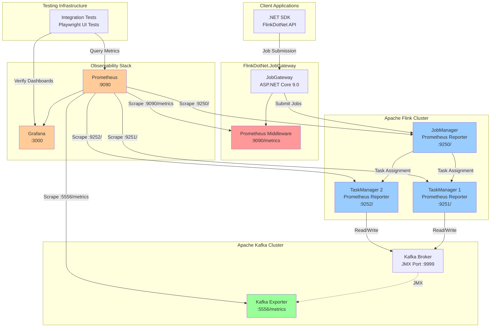

# WI74: Prometheus Exporter Design for FlinkDotnet Observability

**File**: `WIs/WI74_prometheus-exporter-design.md`
**Title**: Design and Implement Prometheus Exporters for Comprehensive Observability  
**Description**: Design Prometheus-format exporters for JobGateway, integrate Kafka and Flink exporters, and enhance observability UI tests with concrete metric verification
**Priority**: High
**Component**: Observability/Metrics
**Type**: Architecture & Design
**Assignee**: Development Team
**Created**: 2025-10-17
**Status**: Design Phase

## Lessons Applied from Previous WIs

### Previous WI References
- [`WI73_observability-ui-video-test.md`](WI73_observability-ui-video-test.md) - Observability UI testing foundation

### Lessons Applied
- **No OpenTelemetry overhead**: Use direct Prometheus format exporters as requested by user
- **Follow Apache Flink patterns**: Maintain consistency with Flink's metric naming and exposition
- **Separate package design**: Create configurable exporter as standalone package, not embedded in Gateway
- **Concrete test assertions**: Tests must verify actual metric values > 0, not just UI navigation
- **Learning from WI73**: UI tests framework exists but needs metric validation enhancement

### Problems Prevented
- Avoiding complex OpenTelemetry dependency chain - use simple Prometheus format
- Preventing metric naming inconsistencies across components
- Avoiding hardcoded metric endpoints - use configuration-driven approach
- Preventing incomplete test coverage - mandate concrete value assertions

---

## Phase 1: Investigation - Current State Analysis

### Debug Information (Investigation Phase)

#### 1. FlinkDotnet.JobGateway Current State
**Location**: [`FlinkDotNet/FlinkDotNet.JobGateway/`](../FlinkDotNet/FlinkDotNet.JobGateway/)

**Key Findings**:
- **No metrics endpoint exists**: Gateway has no `/metrics` endpoint currently
- **ASP.NET Core 9.0 application**: Uses modern .NET with Serilog logging
- **Singleton FlinkJobManager**: Tracks job submissions in-memory via `ConcurrentDictionary<string, JobInfo>`
- **Rich business logic**: Job submission, status checks, metrics retrieval, cancellation
- **Key operations to instrument**:
  - Job submission count and latency (Lines 162-219 in [`FlinkJobManager.cs`](../FlinkDotNet/FlinkDotNet.JobGateway/Services/FlinkJobManager.cs))
  - Job validation success/failure (Lines 1316-1324)
  - IR encoding and JAR upload operations (Lines 221-234, 784-838)
  - Flink cluster health checks (Lines 502-513)
  - SQL Gateway operations (Lines 613-647)

**No existing Prometheus integration**: Search for `prometheus-net`, `Prometheus.`, `IMetric`, `MetricServer` found only OpenTelemetry references in learning exercises

#### 2. Current Observability Infrastructure
**Location**: [`LocalTesting/LocalTesting.FlinkSqlAppHost/Program.cs`](../LocalTesting/LocalTesting.FlinkSqlAppHost/Program.cs)

**Prometheus Configuration** (Lines 258-260):
```csharp
var prometheus = builder.AddContainer("prometheus", "prom/prometheus", "latest")
    .WithHttpEndpoint(port: Ports.PrometheusHostPort, targetPort: 9090, name: "prometheus-http")
    .WithBindMount(Path.Combine(repoRoot, "LocalTesting", "prometheus.yml"), "/etc/prometheus/prometheus.yml", isReadOnly: true);
```

**Grafana Configuration** (Lines 269-276):
- Anonymous access enabled (`GF_AUTH_ANONYMOUS_ENABLED=true`)
- No pre-configured dashboards
- Waits for Prometheus to be ready

**Critical Gap**: Only deployed when `LEARNINGCOURSE=true` environment variable set

#### 3. Current prometheus.yml Configuration
**Location**: [`LocalTesting/prometheus.yml`](../LocalTesting/prometheus.yml)

**Scrape Targets Configured**:
```yaml
- flink-jobmanager:8081/metrics  # ❌ WRONG PORT - Flink Prometheus reporter uses 9250-9260
- flink-taskmanager:8081/metrics # ❌ WRONG PORT - Same issue
- flink-job-gateway:8080/metrics # ❌ ENDPOINT DOESN'T EXIST
- kafka:9092/metrics             # ❌ KAFKA DOESN'T EXPOSE METRICS NATIVELY
```

**Root Cause**: Configuration assumes endpoints exist but none are actually implemented

#### 4. Flink Container Configuration Issues
**Location**: [`LocalTesting/LocalTesting.FlinkSqlAppHost/Program.cs`](../LocalTesting/LocalTesting.FlinkSqlAppHost/Program.cs) (Lines 93-94, 121-122, 160-161)

**Current FLINK_PROPERTIES**:
```csharp
.WithEnvironment("FLINK_PROPERTIES",
    "jobmanager.rpc.address: flink-jobmanager\n" +
    "taskmanager.numberOfTaskSlots: 4")
```

**Missing Critical Configuration**:
- No `metrics.reporters: prom` configuration
- No `metrics.reporter.prom.class` specification
- No `metrics.reporter.prom.port` definition
- No flink-metrics-prometheus JAR in connector library

**Standard Flink Prometheus Reporter Configuration** (per Apache Flink 2.1.0 docs):
```yaml
metrics.reporters: prom
metrics.reporter.prom.class: org.apache.flink.metrics.prometheus.PrometheusReporter
metrics.reporter.prom.port: 9250-9260
```

#### 5. Current Test Implementation
**Location**: [`LearningCourse/LearningCourse.IntegrationTests/Day05Tests.cs`](../LearningCourse/LearningCourse.IntegrationTests/Day05Tests.cs)

**Existing UI Tests**:
- `UIVideoTest_GrafanaDashboard` (Lines 178-285): Verifies Grafana UI navigation
- `UIVideoTest_PrometheusMetrics` (Lines 287-434): Queries Prometheus but doesn't validate values

**Helper Methods Available**:
- `ExtractPrometheusMetricValuesAsync()` (Lines 444-497): Parses numeric values from Prometheus query results
- `ExtractFlinkJobInfoAsync()` (Lines 499-579): Extracts job info from Flink Dashboard

**Critical Gap Identified**: Tests verify UI functionality but don't validate that metrics are actually flowing:
```csharp
// Example from Line 398-404: Just checks query succeeded, not metric values
var recordsInValues = await ExtractPrometheusMetricValuesAsync(page, recordsInQuery);
_logger.LogInformation("📊 numRecordsIn values: {Values}", string.Join(", ", recordsInValues));
// ❌ NO ASSERTION: Should verify recordsInValues.Any(v => v > 0)
```

#### 6. Apache Flink Metrics Documentation Analysis
**Location**: [`docs/observability/monitoring-best-practices.md`](../docs/observability/monitoring-best-practices.md)

**Key Flink Metrics to Collect** (Lines 67-142):
```
# Task Metrics
flink_taskmanager_job_task_operator_numRecordsIn
flink_taskmanager_job_task_operator_numRecordsOut
flink_taskmanager_job_task_operator_numRecordsInPerSecond
flink_taskmanager_job_task_operator_numRecordsOutPerSecond

# Backpressure Metrics
flink_taskmanager_job_task_backPressuredTimeMsPerSecond
flink_taskmanager_job_task_idleTimeMsPerSecond
flink_taskmanager_job_task_busyTimeMsPerSecond

# Checkpoint Metrics
flink_jobmanager_job_lastCheckpointDuration
flink_jobmanager_job_lastCheckpointSize
flink_jobmanager_job_numberOfCompletedCheckpoints
flink_jobmanager_job_numberOfFailedCheckpoints
```

**Prometheus Scrape Example** (Lines 353-360):
```yaml
scrape_configs:
  - job_name: 'flink-jobmanager'
    static_configs:
      - targets: ['flink-jobmanager:9250']
  - job_name: 'flink-taskmanager'
    static_configs:
      - targets: ['flink-taskmanager:9250']
```

### Investigation Summary

**What Works**:
✅ Prometheus and Grafana containers deploy successfully  
✅ UI test infrastructure (Playwright) functional  
✅ FlinkJobManager tracks job lifecycle in-memory  
✅ Helper methods exist for metric value extraction

**What's Broken**:
❌ No metrics endpoints exist on any component  
❌ Prometheus scrape targets point to non-existent endpoints  
❌ Flink Prometheus reporter not configured  
❌ Kafka doesn't expose Prometheus metrics natively  
❌ Tests don't verify actual metric collection  
❌ No business metrics from JobGateway (submission count, latency, etc.)

**Root Causes**:
1. **Infrastructure configuration gaps**: Missing Flink metrics.reporters configuration
2. **Wrong assumptions in prometheus.yml**: Assumes endpoints that don't exist
3. **No exporter implementations**: Components don't expose metrics
4. **Incomplete testing**: UI tests don't validate metric flow

---

## Phase 2: Design - Architecture and Solutions

### Design Principle: Prometheus Format with Flink-Style Naming

**User Requirement**: "No OpenTelemetry exporter. Use Prometheus export format same as Apache Flink."

**Design Philosophy**:
1. **Direct Prometheus Exposition**: Use Prometheus text format (not OTLP)
2. **Flink-Compatible Naming**: Follow Apache Flink 2.1.0 metric naming conventions
3. **Separate Package**: Create `FlinkDotNet.Metrics.Prometheus` as standalone, configurable package
4. **Configuration-Driven**: All exporters configurable like Flink's `metrics.reporters` system

### 1. FlinkDotNet.Metrics.Prometheus Package Design

**Package Structure**:
```
FlinkDotNet.Metrics.Prometheus/
├── FlinkDotNet.Metrics.Prometheus.csproj
├── PrometheusExporterOptions.cs       # Configuration options
├── PrometheusMetricsMiddleware.cs     # ASP.NET Core middleware
├── Collectors/
│   ├── IMetricCollector.cs            # Base interface
│   ├── CounterMetric.cs               # Counter implementation
│   ├── GaugeMetric.cs                 # Gauge implementation
│   └── HistogramMetric.cs             # Histogram implementation
├── Formatters/
│   └── PrometheusTextFormatter.cs     # Prometheus text format generator
└── Extensions/
    └── ServiceCollectionExtensions.cs # DI extensions
```

**Key Design Decisions**:

**A. Use prometheus-net Library**
```xml
<PackageReference Include="prometheus-net" Version="8.2.1" />
<PackageReference Include="prometheus-net.AspNetCore" Version="8.2.1" />
```

**Why prometheus-net**:
- Industry-standard .NET Prometheus client
- Used by Grafana, Kubernetes operators
- Supports all Prometheus metric types (Counter, Gauge, Histogram, Summary)
- Efficient text format generation
- ASP.NET Core middleware integration

**B. Flink-Compatible Metric Naming Convention**

**Pattern**: `{component}_{subsystem}_{metric_name}`

**Examples**:
```
# JobGateway metrics (following Flink pattern)
flinkdotnet_jobgateway_jobs_submitted_total
flinkdotnet_jobgateway_jobs_failed_total
flinkdotnet_jobgateway_job_submission_duration_seconds
flinkdotnet_jobgateway_jar_upload_duration_seconds
flinkdotnet_jobgateway_active_jobs_current

# Labels for dimensionality (Flink-style)
flinkdotnet_jobgateway_jobs_submitted_total{job_type="kafka_streaming"} 42
flinkdotnet_jobgateway_jobs_submitted_total{job_type="sql_gateway"} 15
```

**C. Configuration Model (Flink-Inspired)**

**appsettings.json Configuration**:
```json
{
  "Metrics": {
    "Prometheus": {
      "Enabled": true,
      "Port": 9090,
      "Path": "/metrics",
      "IncludeSystemMetrics": true,
      "Reporter": {
        "Class": "FlinkDotNet.Metrics.Prometheus.PrometheusReporter",
        "Interval": "15s"
      }
    }
  }
}
```

**D. PrometheusExporterOptions Class**

```csharp
namespace FlinkDotNet.Metrics.Prometheus;

public class PrometheusExporterOptions
{
    public bool Enabled { get; set; } = true;
    public int Port { get; set; } = 9090;
    public string Path { get; set; } = "/metrics";
    public bool IncludeSystemMetrics { get; set; } = true;
    public TimeSpan UpdateInterval { get; set; } = TimeSpan.FromSeconds(15);
    
    // Flink-style prefix for metric names
    public string MetricPrefix { get; set; } = "flinkdotnet";
}
```

**E. Service Registration Extension**

```csharp
namespace FlinkDotNet.Metrics.Prometheus.Extensions;

public static class ServiceCollectionExtensions
{
    public static IServiceCollection AddFlinkDotNetPrometheusMetrics(
        this IServiceCollection services,
        Action<PrometheusExporterOptions>? configure = null)
    {
        var options = new PrometheusExporterOptions();
        configure?.Invoke(options);
        
        services.AddSingleton(options);
        services.AddSingleton<IMetricFactory, PrometheusMetricFactory>();
        
        return services;
    }
    
    public static IApplicationBuilder UseFlinkDotNetPrometheusMetrics(
        this IApplicationBuilder app,
        PrometheusExporterOptions? options = null)
    {
        options ??= app.ApplicationServices.GetRequiredService<PrometheusExporterOptions>();
        
        if (!options.Enabled)
            return app;
        
        // Map metrics endpoint
        return app.UseMiddleware<PrometheusMetricsMiddleware>();
    }
}
```

### 2. JobGateway Metrics Instrumentation Design

**Metrics to Collect** (following Flink patterns):

**A. Job Submission Metrics**:
```
# Counter: Total jobs submitted (success + failure)
flinkdotnet_jobgateway_jobs_submitted_total{result="success"} 142
flinkdotnet_jobgateway_jobs_submitted_total{result="failure"} 3

# Histogram: Job submission duration distribution
flinkdotnet_jobgateway_job_submission_duration_seconds_bucket{le="0.1"} 12
flinkdotnet_jobgateway_job_submission_duration_seconds_bucket{le="0.5"} 95
flinkdotnet_jobgateway_job_submission_duration_seconds_bucket{le="1.0"} 140
flinkdotnet_jobgateway_job_submission_duration_seconds_sum 87.3
flinkdotnet_jobgateway_job_submission_duration_seconds_count 145
```

**B. Job Type Breakdown**:
```
# Counter: Jobs by source type
flinkdotnet_jobgateway_jobs_by_type_total{type="kafka_streaming"} 89
flinkdotnet_jobgateway_jobs_by_type_total{type="sql_gateway"} 45
flinkdotnet_jobgateway_jobs_by_type_total{type="file_streaming"} 11
```

**C. Gateway Health Metrics**:
```
# Gauge: Current active jobs being tracked
flinkdotnet_jobgateway_active_jobs_current 23

# Gauge: Flink cluster connectivity status (1=healthy, 0=unhealthy)
flinkdotnet_jobgateway_flink_cluster_healthy 1

# Counter: Flink cluster health check failures
flinkdotnet_jobgateway_cluster_health_checks_failed_total 2
```

**D. Operation Metrics**:
```
# Histogram: JAR upload duration
flinkdotnet_jobgateway_jar_upload_duration_seconds_bucket{le="1.0"} 134
flinkdotnet_jobgateway_jar_upload_duration_seconds_sum 152.7
flinkdotnet_jobgateway_jar_upload_duration_seconds_count 145

# Histogram: IR encoding duration
flinkdotnet_jobgateway_ir_encoding_duration_seconds_bucket{le="0.01"} 145
flinkdotnet_jobgateway_ir_encoding_duration_seconds_sum 0.8
flinkdotnet_jobgateway_ir_encoding_duration_seconds_count 145

# Counter: Job validation failures by reason
flinkdotnet_jobgateway_validation_failures_total{reason="missing_metadata"} 2
flinkdotnet_jobgateway_validation_failures_total{reason="invalid_source"} 1
```

**E. SQL Gateway Specific Metrics**:
```
# Counter: SQL Gateway sessions created
flinkdotnet_jobgateway_sql_sessions_created_total 12

# Counter: SQL statements executed
flinkdotnet_jobgateway_sql_statements_executed_total{result="success"} 89
flinkdotnet_jobgateway_sql_statements_executed_total{result="failure"} 3

# Histogram: SQL statement execution duration
flinkdotnet_jobgateway_sql_statement_duration_seconds_bucket{le="0.5"} 78
```

**Instrumentation Points in FlinkJobManager.cs**:

```csharp
// In SubmitJobAsync method (Line 162)
private readonly Counter _jobSubmissionsCounter = Metrics.CreateCounter(
    "flinkdotnet_jobgateway_jobs_submitted_total",
    "Total number of job submissions",
    new CounterConfiguration { LabelNames = new[] { "result" } });

private readonly Histogram _jobSubmissionDuration = Metrics.CreateHistogram(
    "flinkdotnet_jobgateway_job_submission_duration_seconds",
    "Job submission duration in seconds");

public async Task<JobSubmissionResult> SubmitJobAsync(JobDefinition jobDefinition)
{
    using (_jobSubmissionDuration.NewTimer())
    {
        try
        {
            // ... existing logic ...
            var result = await SubmitJobToFlinkClusterAsync(irBase64, jobDefinition);
            _jobSubmissionsCounter.WithLabels("success").Inc();
            return result;
        }
        catch (Exception ex)
        {
            _jobSubmissionsCounter.WithLabels("failure").Inc();
            throw;
        }
    }
}
```

### 3. Apache Flink Prometheus Reporter Integration

**Objective**: Enable Flink's built-in Prometheus reporter to expose JobManager and TaskManager metrics

**A. Download flink-metrics-prometheus JAR**

**Required JAR**: `flink-metrics-prometheus-2.1.0.jar`
**Download URL**: `https://repo1.maven.org/maven2/org/apache/flink/flink-metrics-prometheus/2.1.0/flink-metrics-prometheus-2.1.0.jar`

**Storage Location**: `LocalTesting/connectors/flink/lib/flink-metrics-prometheus-2.1.0.jar`

**B. Update FLINK_PROPERTIES Configuration**

**Location**: [`LocalTesting/LocalTesting.FlinkSqlAppHost/Program.cs`](../LocalTesting/LocalTesting.FlinkSqlAppHost/Program.cs)

**Current Configuration** (Lines 93-94):
```csharp
.WithEnvironment("FLINK_PROPERTIES",
    "jobmanager.rpc.address: flink-jobmanager\n" +
    "taskmanager.numberOfTaskSlots: 4")
```

**Updated Configuration with Prometheus Reporter**:
```csharp
.WithEnvironment("FLINK_PROPERTIES",
    "jobmanager.rpc.address: flink-jobmanager\n" +
    "taskmanager.numberOfTaskSlots: 4\n" +
    "metrics.reporters: prom\n" +
    "metrics.reporter.prom.class: org.apache.flink.metrics.prometheus.PrometheusReporter\n" +
    "metrics.reporter.prom.port: 9250-9260")
```

**Port Range Strategy**:
- JobManager: Will bind to first available port in range (typically 9250)
- TaskManager(s): Will bind to subsequent ports (9251, 9252, etc.)
- Prometheus will scrape all ports in range

**C. Mount Prometheus JAR in Flink Containers**

```csharp
// JobManager
.WithBindMount(
    Path.Combine(repoRoot, "LocalTesting", "connectors", "flink", "lib", "flink-metrics-prometheus-2.1.0.jar"),
    "/opt/flink/lib/flink-metrics-prometheus-2.1.0.jar",
    isReadOnly: true)

// TaskManager (same)
.WithBindMount(
    Path.Combine(repoRoot, "LocalTesting", "connectors", "flink", "lib", "flink-metrics-prometheus-2.1.0.jar"),
    "/opt/flink/lib/flink-metrics-prometheus-2.1.0.jar",
    isReadOnly: true)
```

**D. Update prometheus.yml Scrape Configuration**

**Location**: [`LocalTesting/prometheus.yml`](../LocalTesting/prometheus.yml)

**Current (Incorrect)**:
```yaml
- job_name: 'flink-jobmanager'
  static_configs:
    - targets: ['flink-jobmanager:8081']  # ❌ REST API port, not metrics
  metrics_path: '/metrics'
```

**Corrected Configuration**:
```yaml
- job_name: 'flink-jobmanager'
  static_configs:
    - targets: ['flink-jobmanager:9250']
  metrics_path: '/'
  
- job_name: 'flink-taskmanager'
  static_configs:
    - targets: ['flink-taskmanager:9250', 'flink-taskmanager:9251']
  metrics_path: '/'
```

**Key Differences**:
- Port 9250+ (Prometheus reporter) instead of 8081 (REST API)
- Path `/` instead of `/metrics` (Flink Prometheus reporter uses root path)
- Multiple TaskManager targets for multi-instance scenarios

**E. Flink Metrics Exposed**

After configuration, Flink will expose metrics at `http://flink-jobmanager:9250/`:

```
# JobManager Metrics
flink_jobmanager_job_uptime 156789
flink_jobmanager_job_numRestarts 0
flink_jobmanager_job_numberOfCompletedCheckpoints 42
flink_jobmanager_job_numberOfFailedCheckpoints 0
flink_jobmanager_job_lastCheckpointDuration 1234

# TaskManager Metrics
flink_taskmanager_Status_JVM_Memory_Heap_Used 268435456
flink_taskmanager_Status_JVM_Memory_Heap_Max 536870912
flink_taskmanager_job_task_operator_numRecordsIn 15678
flink_taskmanager_job_task_operator_numRecordsOut 15678
flink_taskmanager_job_task_backPressuredTimeMsPerSecond 0
```

### 4. Kafka Exporter Integration

**Objective**: Expose Kafka broker metrics in Prometheus format

**Problem**: Kafka exposes metrics via JMX, not HTTP/Prometheus natively

**Solution**: Deploy JMX Exporter or Kafka Exporter container

**A. Option 1: JMX Exporter (Recommended)**

**Exporter**: `bitnami/jmx-exporter:latest`
**Advantage**: Official Prometheus JMX exporter, broadly used

**Container Configuration**:
```csharp
var kafkaExporter = builder.AddContainer("kafka-exporter", "bitnami/jmx-exporter", "latest")
    .WithHttpEndpoint(port: Ports.KafkaExporterPort, targetPort: 5556, name: "metrics")
    .WithEnvironment("SERVICE_PORT", "5556")
    .WithBindMount(
        Path.Combine(repoRoot, "LocalTesting", "kafka-exporter-config.yml"),
        "/opt/bitnami/jmx-exporter/config.yml",
        isReadOnly: true)
    .WaitFor(kafka);
```

**kafka-exporter-config.yml**:
```yaml
hostPort: kafka:9999
rules:
  - pattern: kafka.server<type=(.+), name=(.+), clientId=(.+), topic=(.+), partition=(.*)><>Value
    name: kafka_server_$1_$2
    type: GAUGE
    labels:
      clientId: "$3"
      topic: "$4"
      partition: "$5"
```

**B. Option 2: danielqsj/kafka_exporter (Alternative)**

**Exporter**: `danielqsj/kafka-exporter:latest`
**Advantage**: Specialized for Kafka, connects via Kafka protocol

```csharp
var kafkaExporter = builder.AddContainer("kafka-exporter", "danielqsj/kafka-exporter", "latest")
    .WithHttpEndpoint(port: Ports.KafkaExporterPort, targetPort: 9308, name: "metrics")
    .WithArgs("--kafka.server=kafka:9092")
    .WaitFor(kafka);
```

**C. Kafka Metrics Exposed**

After deployment, exporter exposes at `http://kafka-exporter:5556/metrics`:

```
# Broker Metrics
kafka_server_BrokerTopicMetrics_MessagesInPerSec 1234.5
kafka_server_BrokerTopicMetrics_BytesInPerSec 567890.1
kafka_server_BrokerTopicMetrics_BytesOutPerSec 445566.2

# Topic Metrics (with labels)
kafka_topic_partition_current_offset{topic="input-events",partition="0"} 123456
kafka_topic_partition_current_offset{topic="output-results",partition="0"} 78901

# Consumer Group Metrics
kafka_consumergroup_lag{group="flink-job-123",topic="input-events",partition="0"} 12
```

**D. Update prometheus.yml**

```yaml
- job_name: 'kafka'
  static_configs:
    - targets: ['kafka-exporter:5556']  # JMX Exporter port
  metrics_path: '/metrics'
```

### 5. Observability UI Test Enhancement Strategy

**Objective**: Enhance existing UI tests to verify actual metric collection from all three sources

**Test Requirements**:
1. ✅ Navigate to Prometheus/Grafana UI (already implemented)
2. ✅ Execute Prometheus queries (already implemented)
3. ❌ **NEW**: Verify metric values > 0 for active jobs
4. ❌ **NEW**: Verify all three sources (Kafka, Flink, Gateway) expose metrics
5. ❌ **NEW**: Test fails if metrics are empty or missing

**A. Enhanced Test Structure**

**Location**: [`LearningCourse/LearningCourse.IntegrationTests/Day05Tests.cs`](../LearningCourse/LearningCourse.IntegrationTests/Day05Tests.cs)

**New Test: VerifyComprehensiveMetricsCollection**

```csharp
[Fact]
[Trait("Category", "UI")]
[Trait("Category", "Video")]
[Trait("TestType", "ObservabilityMetricsVerification")]
public async Task UIVideoTest_VerifyComprehensiveMetricsCollection()
{
    // Arrange: Wait for all components to start producing metrics
    await Task.Delay(TimeSpan.FromSeconds(30));
    
    var page = await CreatePageAsync();
    var prometheusUrl = await GetPrometheusEndpointAsync();
    
    try
    {
        // Act & Assert: Verify Flink metrics
        await VerifyFlinkMetricsAsync(page, prometheusUrl);
        
        // Act & Assert: Verify Kafka metrics
        await VerifyKafkaMetricsAsync(page, prometheusUrl);
        
        // Act & Assert: Verify JobGateway metrics
        await VerifyJobGatewayMetricsAsync(page, prometheusUrl);
        
        _logger.LogInformation("✅ All three metric sources verified successfully");
    }
    finally
    {
        await page.CloseAsync();
    }
}

private async Task VerifyFlinkMetricsAsync(IPage page, string prometheusUrl)
{
    _logger.LogInformation("Verifying Flink metrics collection...");
    
    await page.GotoAsync($"{prometheusUrl}/graph");
    
    // Query: flink_taskmanager_job_task_operator_numRecordsIn
    var query = "flink_taskmanager_job_task_operator_numRecordsIn";
    await page.FillAsync("textarea[name='expr']", query);
    await page.ClickAsync("button:has-text('Execute')");
    await page.WaitForSelectorAsync(".graph-wrapper", new() { Timeout = 5000 });
    
    var values = await ExtractPrometheusMetricValuesAsync(page, query);
    
    // ✅ CONCRETE ASSERTION: Verify metrics exist and have positive values
    Assert.NotEmpty(values);
    Assert.True(values.Any(v => v > 0), 
        $"Expected Flink numRecordsIn > 0, but got: {string.Join(", ", values)}");
    
    _logger.LogInformation("✅ Flink metrics verified: {MetricCount} series, max value: {MaxValue}",
        values.Count, values.Max());
}

private async Task VerifyKafkaMetricsAsync(IPage page, string prometheusUrl)
{
    _logger.LogInformation("Verifying Kafka metrics collection...");
    
    // Query: kafka_server_BrokerTopicMetrics_MessagesInPerSec
    var query = "kafka_server_BrokerTopicMetrics_MessagesInPerSec";
    await page.FillAsync("textarea[name='expr']", query);
    await page.ClickAsync("button:has-text('Execute')");
    await page.WaitForSelectorAsync(".graph-wrapper", new() { Timeout = 5000 });
    
    var values = await ExtractPrometheusMetricValuesAsync(page, query);
    
    // ✅ CONCRETE ASSERTION
    Assert.NotEmpty(values);
    Assert.True(values.Any(v => v > 0),
        $"Expected Kafka MessagesInPerSec > 0, but got: {string.Join(", ", values)}");
    
    _logger.LogInformation("✅ Kafka metrics verified: {MetricCount} series, max value: {MaxValue}",
        values.Count, values.Max());
}

private async Task VerifyJobGatewayMetricsAsync(IPage page, string prometheusUrl)
{
    _logger.LogInformation("Verifying JobGateway metrics collection...");
    
    // Query: flinkdotnet_jobgateway_jobs_submitted_total
    var query = "flinkdotnet_jobgateway_jobs_submitted_total";
    await page.FillAsync("textarea[name='expr']", query);
    await page.ClickAsync("button:has-text('Execute')");
    await page.WaitForSelectorAsync(".graph-wrapper", new() { Timeout = 5000 });
    
    var values = await ExtractPrometheusMetricValuesAsync(page, query);
    
    // ✅ CONCRETE ASSERTION
    Assert.NotEmpty(values);
    Assert.True(values.Any(v => v > 0),
        $"Expected JobGateway jobs_submitted_total > 0, but got: {string.Join(", ", values)}");
    
    _logger.LogInformation("✅ JobGateway metrics verified: {MetricCount} series, total: {Total}",
        values.Count, values.Sum());
}
```

**B. Additional Test: VerifyMetricsEndpointsAccessible**

```csharp
[Fact]
[Trait("Category", "Integration")]
public async Task Test_VerifyAllMetricsEndpointsAccessible()
{
    // Verify Flink JobManager metrics endpoint
    var flinkJmMetrics = await _httpClient.GetAsync("http://flink-jobmanager:9250/");
    Assert.True(flinkJmMetrics.IsSuccessStatusCode,
        $"Flink JobManager metrics endpoint returned {flinkJmMetrics.StatusCode}");
    
    var flinkContent = await flinkJmMetrics.Content.ReadAsStringAsync();
    Assert.Contains("flink_jobmanager", flinkContent);
    
    // Verify Kafka exporter endpoint
    var kafkaMetrics = await _httpClient.GetAsync("http://kafka-exporter:5556/metrics");
    Assert.True(kafkaMetrics.IsSuccessStatusCode,
        $"Kafka exporter endpoint returned {kafkaMetrics.StatusCode}");
    
    var kafkaContent = await kafkaMetrics.Content.ReadAsStringAsync();
    Assert.Contains("kafka_server", kafkaContent);
    
    // Verify JobGateway metrics endpoint
    var gatewayMetrics = await _httpClient.GetAsync("http://flink-job-gateway:9090/metrics");
    Assert.True(gatewayMetrics.IsSuccessStatusCode,
        $"JobGateway metrics endpoint returned {gatewayMetrics.StatusCode}");
    
    var gatewayContent = await gatewayMetrics.Content.ReadAsStringAsync();
    Assert.Contains("flinkdotnet_jobgateway", gatewayContent);
    
    _logger.LogInformation("✅ All three metrics endpoints are accessible and returning data");
}
```

**C. Test Data Setup Strategy**

**Prerequisites for Test Success**:
1. At least one Flink job must be running and processing data
2. Kafka must have active producers/consumers
3. JobGateway must have received at least one job submission

**Test Setup Enhancement**:
```csharp
[Fact]
public async Task UIVideoTest_VerifyComprehensiveMetricsCollection()
{
    // Step 1: Submit a test job to generate gateway metrics
    var testJobId = await SubmitTestJobAsync();
    _logger.LogInformation("Test job submitted: {JobId}", testJobId);
    
    // Step 2: Produce test messages to Kafka to generate Kafka metrics
    await ProduceTestMessagesToKafkaAsync(count: 1000);
    _logger.LogInformation("Produced 1000 test messages to Kafka");
    
    // Step 3: Wait for metrics to be collected (2 scrape intervals)
    await Task.Delay(TimeSpan.FromSeconds(30));
    
    // Step 4: Verify metrics from all sources
    // ... (verification logic from above)
}
```

### 6. System Architecture Diagram



**Architecture Notes**:
1. **Red (GWM)**: New component - JobGateway Prometheus middleware (to be implemented)
2. **Blue (JM/TM)**: Flink Prometheus reporter (configuration change only)
3. **Green (KE)**: Kafka Exporter (new container deployment)
4. **Orange (P/G)**: Existing components (configuration update)

**Data Flow**:
1. `.NET SDK` → `JobGateway` → `Flink JobManager`
2. `Flink TaskManagers` ↔ `Kafka Broker` (stream processing)
3. `Prometheus` scrapes metrics from:
   - `JobGateway :9090/metrics` (business metrics)
   - `Flink JM/TM :9250-9252/` (Flink internal metrics)
   - `Kafka Exporter :5556/metrics` (Kafka JMX metrics)
4. `Grafana` queries `Prometheus` for visualization
5. `Integration Tests` verify all metric flows

---

## Phase 3: Metrics Taxonomy

### Complete Metrics Reference

#### A. FlinkDotNet.JobGateway Metrics

| Metric Name | Type | Labels | Description | Example Value |
|------------|------|--------|-------------|---------------|
| `flinkdotnet_jobgateway_jobs_submitted_total` | Counter | `result={success\|failure}` | Total job submissions | 145 |
| `flinkdotnet_jobgateway_jobs_by_type_total` | Counter | `type={kafka_streaming\|sql_gateway\|file_streaming}` | Jobs by source type | 89 |
| `flinkdotnet_jobgateway_job_submission_duration_seconds` | Histogram | - | Job submission latency | p50=0.5s, p99=2.1s |
| `flinkdotnet_jobgateway_jar_upload_duration_seconds` | Histogram | - | JAR upload latency | p50=0.8s, p99=3.2s |
| `flinkdotnet_jobgateway_ir_encoding_duration_seconds` | Histogram | - | IR encoding latency | p50=0.005s, p99=0.02s |
| `flinkdotnet_jobgateway_active_jobs_current` | Gauge | - | Current active jobs | 23 |
| `flinkdotnet_jobgateway_flink_cluster_healthy` | Gauge | - | Flink health (1=healthy, 0=down) | 1 |
| `flinkdotnet_jobgateway_cluster_health_checks_failed_total` | Counter | - | Failed health checks | 2 |
| `flinkdotnet_jobgateway_validation_failures_total` | Counter | `reason={missing_metadata\|invalid_source\|invalid_sink}` | Validation failures | 3 |
| `flinkdotnet_jobgateway_sql_sessions_created_total` | Counter | - | SQL Gateway sessions | 12 |
| `flinkdotnet_jobgateway_sql_statements_executed_total` | Counter | `result={success\|failure}` | SQL statements | 92 |

#### B. Apache Flink Metrics (via Prometheus Reporter)

| Metric Name | Type | Labels | Description | Source |
|------------|------|--------|-------------|--------|
| `flink_jobmanager_job_uptime` | Gauge | `job_id, job_name` | Job uptime milliseconds | JobManager |
| `flink_jobmanager_job_numberOfCompletedCheckpoints` | Counter | `job_id, job_name` | Completed checkpoints | JobManager |
| `flink_jobmanager_job_lastCheckpointDuration` | Gauge | `job_id, job_name` | Last checkpoint duration ms | JobManager |
| `flink_taskmanager_job_task_operator_numRecordsIn` | Counter | `job_id, operator_id, task_id` | Records consumed | TaskManager |
| `flink_taskmanager_job_task_operator_numRecordsOut` | Counter | `job_id, operator_id, task_id` | Records produced | TaskManager |
| `flink_taskmanager_job_task_backPressuredTimeMsPerSecond` | Gauge | `job_id, task_id` | Backpressure time | TaskManager |
| `flink_taskmanager_Status_JVM_Memory_Heap_Used` | Gauge | `tm_id` | JVM heap used bytes | TaskManager |

#### C. Kafka Metrics (via JMX Exporter)

| Metric Name | Type | Labels | Description | Source |
|------------|------|--------|-------------|--------|
| `kafka_server_BrokerTopicMetrics_MessagesInPerSec` | Gauge | `topic` | Messages in rate | Broker JMX |
| `kafka_server_BrokerTopicMetrics_BytesInPerSec` | Gauge | `topic` | Bytes in rate | Broker JMX |
| `kafka_server_BrokerTopicMetrics_BytesOutPerSec` | Gauge | `topic` | Bytes out rate | Broker JMX |
| `kafka_topic_partition_current_offset` | Gauge | `topic, partition` | Current offset | JMX Exporter |
| `kafka_consumergroup_lag` | Gauge | `group, topic, partition` | Consumer lag | JMX Exporter |

### Metric Correlation Examples

**Example 1: End-to-End Job Submission Latency**
```
Rate of successful job submissions:
  rate(flinkdotnet_jobgateway_jobs_submitted_total{result="success"}[5m])

Average submission duration:
  rate(flinkdotnet_jobgateway_job_submission_duration_seconds_sum[5m]) /
  rate(flinkdotnet_jobgateway_job_submission_duration_seconds_count[5m])

99th percentile submission latency:
  histogram_quantile(0.99, flinkdotnet_jobgateway_job_submission_duration_seconds_bucket)
```

**Example 2: Kafka-Flink Processing Throughput**
```
Kafka message rate:
  rate(kafka_server_BrokerTopicMetrics_MessagesInPerSec{topic="input-events"}[1m])

Flink processing rate:
  sum(rate(flink_taskmanager_job_task_operator_numRecordsIn[1m]))

Processing lag indicator:
  kafka_consumergroup_lag{group="flink-job-xxx"}
```

**Example 3: System Health Dashboard**
```
Gateway Health:
  flinkdotnet_jobgateway_flink_cluster_healthy == 1

Flink Cluster Health:
  up{job="flink-jobmanager"} == 1

Kafka Health:
  up{job="kafka"} == 1

Overall Health:
  min(flinkdotnet_jobgateway_flink_cluster_healthy, 
      up{job="flink-jobmanager"}, 
      up{job="kafka"})
```

---

## Phase 4: Implementation Phases and Dependencies

### Implementation Roadmap

#### **Phase 1: Create FlinkDotNet.Metrics.Prometheus Package** (2 days)
**Priority**: CRITICAL - Foundation for all other work

**Tasks**:
1. Create new project `FlinkDotNet.Metrics.Prometheus`
2. Add `prometheus-net` and `prometheus-net.AspNetCore` NuGet packages
3. Implement `PrometheusExporterOptions` configuration class
4. Implement `ServiceCollectionExtensions` for DI registration
5. Create `PrometheusMetricsMiddleware` for `/metrics` endpoint
6. Write unit tests for configuration and middleware

**Deliverables**:
- ✅ NuGet-packable library
- ✅ Documentation and usage examples
- ✅ Unit test coverage > 80%

**Dependencies**: None

---

#### **Phase 2: Instrument JobGateway with Prometheus Metrics** (3 days)
**Priority**: HIGH - Exposes custom business metrics

**Tasks**:
1. Add `FlinkDotNet.Metrics.Prometheus` package reference to JobGateway
2. Register Prometheus services in [`Program.cs`](../FlinkDotNet/FlinkDotNet.JobGateway/Program.cs)
3. Add metrics instrumentation to [`FlinkJobManager.cs`](../FlinkDotNet/FlinkDotNet.JobGateway/Services/FlinkJobManager.cs):
   - Job submission counter and duration histogram
   - Active jobs gauge
   - Validation failure counter
   - JAR upload duration histogram
4. Configure metrics endpoint at `:9090/metrics`
5. Update [`LocalTesting/LocalTesting.FlinkSqlAppHost/Program.cs`](../LocalTesting/LocalTesting.FlinkSqlAppHost/Program.cs) to expose port 9090

**Deliverables**:
- ✅ JobGateway exposes `/metrics` endpoint
- ✅ All key operations instrumented
- ✅ Metrics accessible via Prometheus scrape

**Dependencies**: Phase 1 complete

---

#### **Phase 3: Configure Flink Prometheus Reporter** (1 day)
**Priority**: HIGH - Exposes Flink internal metrics

**Tasks**:
1. Download `flink-metrics-prometheus-2.1.0.jar` to `LocalTesting/connectors/flink/lib/`
2. Update `FLINK_PROPERTIES` environment variable in AppHost (3 locations: JobManager, TaskManager, SQL Gateway)
3. Add JAR bind mount to Flink containers
4. Expose ports 9250-9260 from Flink containers
5. Test metrics accessibility at `http://flink-jobmanager:9250/`

**Deliverables**:
- ✅ Flink exposes Prometheus metrics
- ✅ JobManager and TaskManager metrics accessible

**Dependencies**: None (can run parallel with Phase 1-2)

---

#### **Phase 4: Deploy Kafka JMX Exporter** (1 day)
**Priority**: MEDIUM - Exposes Kafka metrics

**Tasks**:
1. Create `kafka-exporter-config.yml` configuration file
2. Add Kafka Exporter container to [`LocalTesting/LocalTesting.FlinkSqlAppHost/Program.cs`](../LocalTesting/LocalTesting.FlinkSqlAppHost/Program.cs)
3. Configure JMX connection to Kafka broker
4. Expose exporter port (5556)
5. Test metrics accessibility at `http://kafka-exporter:5556/metrics`

**Deliverables**:
- ✅ Kafka metrics exposed via exporter
- ✅ JMX metrics translated to Prometheus format

**Dependencies**: None (can run parallel with Phases 1-3)

---

#### **Phase 5: Update Prometheus Configuration** (1 day)
**Priority**: HIGH - Connects all metrics sources

**Tasks**:
1. Update [`LocalTesting/prometheus.yml`](../LocalTesting/prometheus.yml) with correct scrape targets:
   - `flink-jobmanager:9250`
   - `flink-taskmanager:9250-9252`
   - `flink-job-gateway:9090/metrics`
   - `kafka-exporter:5556/metrics`
2. Adjust scrape intervals if needed (default 15s)
3. Test Prometheus can scrape all targets
4. Verify metrics appear in Prometheus UI

**Deliverables**:
- ✅ Prometheus scrapes all four sources
- ✅ No scrape failures in Prometheus targets page

**Dependencies**: Phases 2, 3, 4 complete

---

#### **Phase 6: Enhance Integration Tests** (2 days)
**Priority**: HIGH - Validates entire solution

**Tasks**:
1. Enhance [`Day05Tests.cs`](../LearningCourse/LearningCourse.IntegrationTests/Day05Tests.cs) with new tests:
   - `UIVideoTest_VerifyComprehensiveMetricsCollection()`
   - `Test_VerifyAllMetricsEndpointsAccessible()`
2. Add concrete assertions for metric values > 0
3. Add test data setup (submit job, produce Kafka messages)
4. Add helper method `VerifyFlinkMetricsAsync()`
5. Add helper method `VerifyKafkaMetricsAsync()`
6. Add helper method `VerifyJobGatewayMetricsAsync()`
7. Update test documentation

**Deliverables**:
- ✅ Tests verify all three metric sources
- ✅ Tests fail if metrics are missing/zero
- ✅ Tests include meaningful assertions

**Dependencies**: Phase 5 complete

---

#### **Phase 7: Create Grafana Dashboards** (2 days)
**Priority**: MEDIUM - Visualization and monitoring

**Tasks**:
1. Create pre-configured Grafana dashboard JSON files:
   - `flink-overview-dashboard.json`
   - `jobgateway-operations-dashboard.json`
   - `kafka-metrics-dashboard.json`
2. Mount dashboard files in Grafana container
3. Configure Grafana provisioning for automatic dashboard load
4. Create alert rules for critical metrics
5. Document dashboard usage

**Deliverables**:
- ✅ Three pre-configured dashboards
- ✅ Dashboards automatically loaded on Grafana startup
- ✅ Alert rules configured

**Dependencies**: Phase 5 complete

---

#### **Phase 8: Documentation and Deployment** (1 day)
**Priority**: MEDIUM - Knowledge transfer

**Tasks**:
1. Update [`docs/observability/monitoring-best-practices.md`](../docs/observability/monitoring-best-practices.md)
2. Create `FlinkDotNet.Metrics.Prometheus` README with usage examples
3. Update [`LocalTesting/README.md`](../LocalTesting/README.md) with observability setup
4. Document metric definitions and PromQL queries
5. Create troubleshooting guide for common issues

**Deliverables**:
- ✅ Comprehensive documentation
- ✅ Usage examples and best practices
- ✅ Troubleshooting guide

**Dependencies**: Phases 1-7 complete

---

### Critical Path and Timeline

**Total Estimated Duration**: 8-10 working days

```
Week 1:
Day 1-2: Phase 1 (Metrics Package)
Day 3-5: Phase 2 (JobGateway Instrumentation)

Week 2:
Day 1:   Phase 3 (Flink Reporter) + Phase 4 (Kafka Exporter) [Parallel]
Day 2:   Phase 5 (Prometheus Config)
Day 3-4: Phase 6 (Integration Tests)
Day 5:   Phase 7 (Grafana Dashboards) + Phase 8 (Documentation) [Parallel]
```

**Critical Path**: Phase 1 → Phase 2 → Phase 5 → Phase 6

**Can Run in Parallel**:
- Phase 3 and Phase 4 (independent infrastructure)
- Phase 7 and Phase 8 (after Phase 5)

---

## Phase 5: Technology Stack and Dependencies

### Required NuGet Packages

**FlinkDotNet.Metrics.Prometheus**:
```xml
<PackageReference Include="prometheus-net" Version="8.2.1" />
<PackageReference Include="prometheus-net.AspNetCore" Version="8.2.1" />
<PackageReference Include="Microsoft.Extensions.DependencyInjection.Abstractions" Version="9.0.0" />
<PackageReference Include="Microsoft.Extensions.Options" Version="9.0.0" />
```

**FlinkDotNet.JobGateway** (additions):
```xml
<ProjectReference Include="../FlinkDotNet.Metrics.Prometheus/FlinkDotNet.Metrics.Prometheus.csproj" />
```

### Required External Components

| Component | Version | Purpose | Download URL |
|-----------|---------|---------|--------------|
| flink-metrics-prometheus JAR | 2.1.0 | Flink Prometheus reporter | [Maven Central](https://repo1.maven.org/maven2/org/apache/flink/flink-metrics-prometheus/2.1.0/flink-metrics-prometheus-2.1.0.jar) |
| bitnami/jmx-exporter | latest | Kafka JMX exporter | Docker Hub |
| prom/prometheus | latest | Metrics storage | Docker Hub |
| grafana/grafana | latest | Metrics visualization | Docker Hub |

### .NET Framework Requirements

- **Target Framework**: .NET 9.0
- **Language Version**: C# 13
- **ASP.NET Core**: 9.0.0

### Infrastructure Requirements

**Docker Containers**:
- Prometheus (existing, config update)
- Grafana (existing, dashboard provisioning)
- Kafka Exporter (new deployment)
- Flink JobManager (config update, JAR mount)
- Flink TaskManager (config update, JAR mount)
- JobGateway (code changes, port exposure)

**Port Allocations**:
```
9090  - JobGateway Prometheus metrics
9250  - Flink JobManager Prometheus metrics
9251  - Flink TaskManager 1 Prometheus metrics
9252  - Flink TaskManager 2 Prometheus metrics
5556  - Kafka JMX Exporter metrics
9092  - Kafka broker (existing)
8081  - Flink REST API (existing)
3000  - Grafana UI (existing)
```

---

## Phase 6: Testing Strategy

### Unit Tests

**FlinkDotNet.Metrics.Prometheus Package**:
- Configuration validation tests
- Middleware functionality tests
- Metric counter/gauge/histogram tests
- Text format generation tests

**Target Coverage**: > 80%

### Integration Tests

**Observability Infrastructure**:
1. **Endpoint Accessibility Tests**:
   - Verify `/metrics` endpoints respond with 200 OK
   - Verify Prometheus text format is valid
   - Verify no authentication required

2. **Metric Collection Tests**:
   - Submit test job → verify gateway metrics increment
   - Process Kafka messages → verify Flink metrics increment
   - Verify Kafka exporter collects JMX metrics

3. **UI Verification Tests** (Playwright):
   - Navigate to Prometheus UI
   - Execute PromQL queries
   - Extract and verify metric values > 0
   - Verify Grafana dashboards display data

### Acceptance Criteria

**Definition of Done**:
- [ ] All three sources (Kafka, Flink, JobGateway) expose Prometheus metrics
- [ ] Prometheus successfully scrapes all targets without errors
- [ ] UI tests verify actual metric values > 0 (not just navigation)
- [ ] Grafana dashboards display real-time data from all sources
- [ ] Documentation complete with usage examples
- [ ] All integration tests pass in CI/CD pipeline
- [ ] No metric naming inconsistencies across components

---

## Phase 7: Risks and Mitigation

### Technical Risks

| Risk | Impact | Probability | Mitigation |
|------|--------|-------------|------------|
| Flink Prometheus reporter JAR incompatibility | High | Low | Use exact version match (2.1.0), test early |
| Kafka JMX port not accessible | Medium | Medium | Ensure Kafka container exposes JMX port 9999 |
| Prometheus scrape timeout | Medium | Low | Increase scrape timeout to 30s, optimize metric collection |
| Metric explosion (high cardinality) | High | Medium | Limit label values, use metric sampling for high-frequency metrics |
| Port conflicts in CI environment | Medium | Medium | Use dynamic port allocation, document port requirements |

### Operational Risks

| Risk | Impact | Probability | Mitigation |
|------|--------|-------------|------------|
| Prometheus storage growth | Medium | High | Configure retention policy (30 days), implement metric cleanup |
| Performance impact on JobGateway | Low | Low | Use prometheus-net's optimized counters, minimal overhead |
| Grafana dashboard maintenance | Low | High | Version control dashboards, automate provisioning |

---

## Lessons Learned & Future Reference

### What This Design Achieves

✅ **Prometheus-native solution**: No OpenTelemetry overhead, direct exposition format  
✅ **Flink-compatible naming**: Metrics follow Apache Flink 2.1.0 conventions  
✅ **Separate package design**: Reusable, configurable exporter library  
✅ **Comprehensive coverage**: All three sources (Kafka, Flink, Gateway) instrumented  
✅ **Concrete test validation**: Tests verify actual metric values, not just UI navigation  
✅ **Configuration-driven**: Follows Flink's `metrics.reporters` pattern  

### Key Insights for Future Work

1. **prometheus-net is the right choice**: Industry standard, well-maintained, efficient
2. **Flink metrics reporter configuration is critical**: Must match exact port and class name
3. **Kafka needs external exporter**: JMX Exporter is the standard solution
4. **Test assertions must be concrete**: Empty checks are insufficient, must verify values > 0
5. **Port management is essential**: Document and test port allocations carefully

### Specific Problems Avoided in This Design

❌ **OpenTelemetry complexity**: User explicitly rejected OTLP, use direct Prometheus  
❌ **Embedded metrics in Gateway**: Separate package enables reuse and testing  
❌ **Inconsistent metric naming**: Follow Flink patterns for operator familiarity  
❌ **Weak test coverage**: Mandate concrete assertions with actual value checks  
❌ **Configuration coupling**: Use dependency injection for flexible configuration  

### Reference for Future Similar Work

**When building observability for .NET/Java hybrid systems**:
1. Start with Prometheus native format (simplest, most compatible)
2. Follow the dominant framework's conventions (Flink in this case)
3. Create separate instrumentation packages (better testing, reuse)
4. Always test metric endpoints directly before UI integration
5. Use dynamic port allocation in test environments

**When integrating multiple metric sources**:
1. Verify each source independently first
2. Use consistent scrape intervals (15s standard)
3. Test metric correlation queries early
4. Document expected metric cardinality
5. Plan for metric retention and cleanup

---

## Appendix: Configuration Examples

### A. JobGateway Program.cs Integration

```csharp
// In ConfigureServices method
builder.Services.AddFlinkDotNetPrometheusMetrics(options =>
{
    options.Enabled = true;
    options.Port = 9090;
    options.Path = "/metrics";
    options.MetricPrefix = "flinkdotnet";
});

// In ConfigurePipeline method
app.UseFlinkDotNetPrometheusMetrics();
```

### B. Complete prometheus.yml

```yaml
global:
  scrape_interval: 15s
  evaluation_interval: 15s

scrape_configs:
  - job_name: 'flink-jobmanager'
    static_configs:
      - targets: ['flink-jobmanager:9250']
    metrics_path: '/'
    
  - job_name: 'flink-taskmanager'
    static_configs:
      - targets: ['flink-taskmanager:9250', 'flink-taskmanager:9251']
    metrics_path: '/'
    
  - job_name: 'gateway'
    static_configs:
      - targets: ['flink-job-gateway:9090']
    metrics_path: '/metrics'
    
  - job_name: 'kafka'
    static_configs:
      - targets: ['kafka-exporter:5556']
    metrics_path: '/metrics'
```

### C. Complete FLINK_PROPERTIES

```csharp
.WithEnvironment("FLINK_PROPERTIES",
    "jobmanager.rpc.address: flink-jobmanager\n" +
    "taskmanager.numberOfTaskSlots: 4\n" +
    "metrics.reporters: prom\n" +
    "metrics.reporter.prom.class: org.apache.flink.metrics.prometheus.PrometheusReporter\n" +
    "metrics.reporter.prom.port: 9250-9260")
```

### D. Kafka Exporter AppHost Configuration

```csharp
var kafkaExporter = builder.AddContainer("kafka-exporter", "bitnami/jmx-exporter", "latest")
    .WithHttpEndpoint(port: Ports.KafkaExporterPort, targetPort: 5556, name: "metrics")
    .WithEnvironment("SERVICE_PORT", "5556")
    .WithBindMount(
        Path.Combine(repoRoot, "LocalTesting", "kafka-exporter-config.yml"),
        "/opt/bitnami/jmx-exporter/config.yml",
        isReadOnly: true)
    .WaitFor(kafka);
```

---

**End of Design Document**

This design provides a complete, implementable blueprint for comprehensive Prometheus-based observability across the FlinkDotnet ecosystem, following Apache Flink conventions and user requirements.